# TÀI LIỆU THIẾT KẾ KIẾN TRÚC HỆ THỐNG
## HỆ THỐNG QUẢN LÝ LƯƠNG

**Phiên bản:** 1.0  
**Ngày tạo:** 2025-01-XX  
**Tác giả:** Development Team

---

## MỤC LỤC

1. [Kiến trúc Hệ thống (System Architecture)](#1-kiến-trúc-hệ-thống-system-architecture)
   - 1.1. [Tầng Giao diện (Presentation Layer)](#11-tầng-giao-diện-presentation-layer)
   - 1.2. [Tầng Xử lý nghiệp vụ (Business Logic Layer)](#12-tầng-xử-lý-nghiệp-vụ-business-logic-layer)
   - 1.3. [Tầng Dữ liệu (Data Layer)](#13-tầng-dữ-liệu-data-layer)
   - 1.4. [Ưu điểm của mô hình 3 lớp](#14-ưu-điểm-của-mô-hình-3-lớp)

2. [Thiết kế Lớp (Class Design)](#2-thiết-kế-lớp-class-design)
   - 2.1. [Biểu đồ Lớp Chi tiết (Detailed Class Diagram)](#21-biểu-đồ-lớp-chi-tiết-detailed-class-diagram)
   - 2.2. [Các lớp chính trong hệ thống](#22-các-lớp-chính-trong-hệ-thống)
   - 2.3. [Quan hệ giữa các lớp](#23-quan-hệ-giữa-các-lớp)
   - 2.4. [Áp dụng Nguyên lý Hướng đối tượng (OOP Principles)](#24-áp-dụng-nguyên-lý-hướng-đối-tượng-oop-principles)
   - 2.5. [Tổng kết](#25-tổng-kết)

3. [Thiết kế Tương tác (Interaction Design)](#3-thiết-kế-tương-tác-interaction-design)

4. [Thiết kế Hành vi (Behavioral Design)](#4-thiết-kế-hành-vi-behavioral-design)

---

## 1. KIẾN TRÚC HỆ THỐNG (SYSTEM ARCHITECTURE)

Hệ thống Quản lý Lương được thiết kế theo mô hình **3 lớp (3-Tier Architecture)** nhằm tách biệt rõ ràng các trách nhiệm và tăng tính bảo trì, mở rộng. Tất cả dữ liệu của hệ thống đều được lưu trữ và quản lý trong **Oracle Database**, đảm bảo tính nhất quán, bảo mật và hiệu năng cao.

### 1.1. Tầng Giao diện (Presentation Layer)

**Mục đích:** Xử lý tương tác với người dùng, hiển thị dữ liệu và thu thập input.

**Công nghệ:**
- **Framework:** Next.js 14 (App Router)
- **UI Library:** React 18
- **Styling:** Tailwind CSS với Design System tokens
- **Type Safety:** TypeScript
- **Database:** Oracle Database (tất cả dữ liệu được lưu trữ trong Oracle DB)

**Các thành phần chính:**

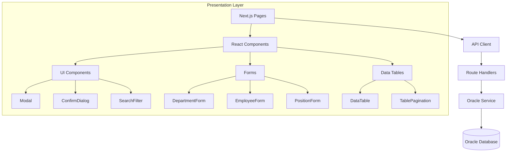

**Chi tiết các thành phần:**

| Thành phần | Mô tả | File/Thư mục |
|------------|-------|--------------|
| **Pages** | Các trang chính của ứng dụng | `app/*/page.tsx` |
| **Components** | Component tái sử dụng | `components/*.tsx` |
| **Forms** | Form nhập liệu | `components/forms/*.tsx` |
| **API Client** | Client gọi API với timeout | `lib/apiClient.ts` |
| **Types** | Định nghĩa TypeScript interfaces | `types/models.ts` |

**Luồng xử lý:**
1. Người dùng tương tác với UI (click, nhập liệu)
2. Component gọi API qua `apiClient`
3. API Route Handler xử lý request và truy vấn Oracle Database
4. Nhận response từ Oracle Database và cập nhật state
5. Re-render UI với dữ liệu mới từ database

### 1.2. Tầng Xử lý nghiệp vụ (Business Logic Layer)

**Mục đích:** Xử lý logic nghiệp vụ, validation, và điều phối giao tiếp giữa Presentation và Data Layer. Tất cả các thao tác dữ liệu đều được thực hiện thông qua Oracle Database, đảm bảo tính toàn vẹn và nhất quán của dữ liệu.

**Các thành phần:**

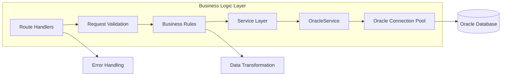

**Chi tiết:**

#### 1.2.1. Route Handlers (API Endpoints)

**Vị trí:** `app/api/*/route.ts`

**Chức năng:**
- Nhận HTTP requests (GET, POST, PUT, DELETE)
- Validate input data
- Gọi Service Layer để xử lý nghiệp vụ và truy vấn Oracle Database
- Trả về JSON response với dữ liệu từ Oracle Database

**Các endpoint chính:**

| Endpoint | Method | Mô tả |
|----------|--------|-------|
| `/api/departments` | GET, POST, PUT, DELETE | CRUD phòng ban |
| `/api/positions` | GET, POST | CRUD chức vụ |
| `/api/employees` | GET, POST | Quản lý nhân viên |
| `/api/contracts` | GET, POST | Quản lý hợp đồng |
| `/api/attendances` | GET | Xem chấm công |
| `/api/rewards` | GET, POST | Quản lý thưởng |
| `/api/penalties` | GET, POST | Quản lý phạt |
| `/api/payrolls` | GET | Xem bảng lương |
| `/api/payments` | GET | Xem phiếu chi |

#### 1.2.2. Service Layer

**Vị trí:** `services/oracleService.ts`

**Chức năng:**
- Cung cấp các phương thức CRUD chuẩn hóa cho Oracle Database
- Quản lý Oracle connection pooling để tối ưu hiệu năng
- Xử lý transaction với Oracle Database
- Error handling và logging cho các thao tác database

**Các phương thức:**

```typescript
class OracleService {
  static async select<T>(sql: string, bindParams?: OracleBindParams): Promise<T[]>
  static async insert(sql: string, bindParams?: OracleBindParams, options?: OracleExecuteOptions): Promise<number>
  static async update(sql: string, bindParams?: OracleBindParams, options?: OracleExecuteOptions): Promise<number>
  static async delete(sql: string, bindParams?: OracleBindParams, options?: OracleExecuteOptions): Promise<number>
}
```

#### 1.2.3. Configuration Management

**Vị trí:** `config/serverConfig.ts`, `config/publicConfig.ts`

**Chức năng:**
- Quản lý cấu hình Oracle Database (credentials, connection string, pool settings)
- Quản lý cấu hình API (base URL, timeout)
- Cấu hình kết nối Oracle Database cho toàn bộ hệ thống

### 1.3. Tầng Dữ liệu (Data Layer)

**Mục đích:** Quản lý truy cập và lưu trữ dữ liệu trong Oracle Database. Tất cả dữ liệu của hệ thống bao gồm: phòng ban, chức vụ, nhân viên, hợp đồng, chấm công, thưởng/phạt, bảng lương, và phiếu chi đều được lưu trữ trong Oracle Database.

**Công nghệ Database:**
- **Database Engine:** Oracle Database
- **Connection Management:** Oracle Connection Pooling
- **Data Access:** Oracle Service Layer với oracledb driver
- **Stored Procedures:** PL/SQL Procedures và Functions
- **Triggers:** Database Triggers cho tự động hóa

**Các thành phần:**

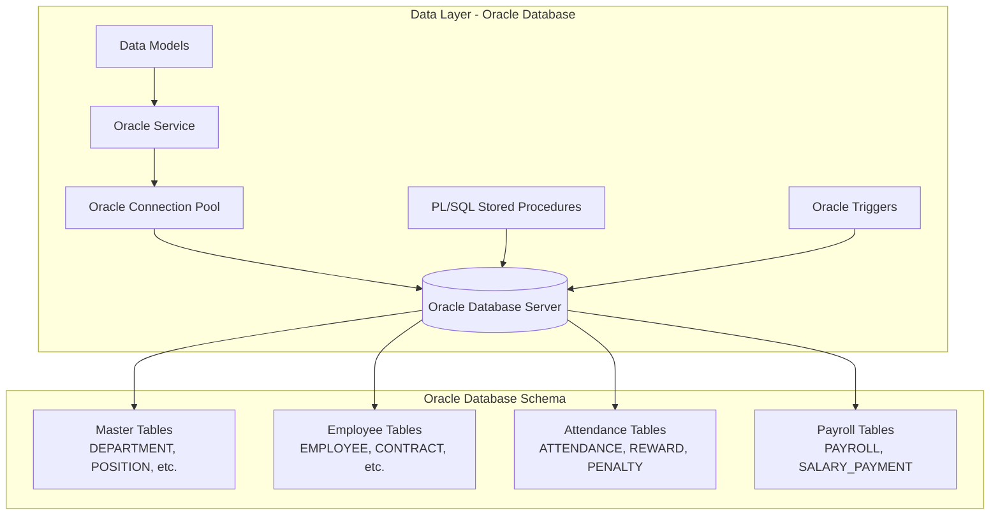

**Chi tiết:**

#### 1.3.1. Oracle Database Connection

**Vị trí:** `lib/oracle.ts`

**Chức năng:**
- Tạo và quản lý Oracle connection pool
- Cấu hình Oracle connection parameters
- Xử lý Oracle connection lifecycle
- Quản lý kết nối đến Oracle Database server

**Cấu hình Oracle Database:**
```typescript
{
  user: string,              // Oracle Database username
  password: string,          // Oracle Database password
  connectString: string,     // Oracle connection string (TNS hoặc Easy Connect)
  poolMin: number,           // Số connection tối thiểu trong pool
  poolMax: number,           // Số connection tối đa trong pool
  poolIncrement: number      // Số connection tăng thêm khi cần
}
```

**Lưu ý:** Tất cả các thao tác dữ liệu đều sử dụng Oracle Database, không có mock data hay dữ liệu tạm thời.

#### 1.3.2. Oracle Database Schema

**Cấu trúc bảng trong Oracle Database:**

Tất cả các bảng sau đây được tạo và quản lý trong Oracle Database:

**Master Tables:**
- `DEPARTMENT` - Phòng ban
- `POSITION` - Chức vụ
- `SALARY_FACTOR_CONFIG` - Cấu hình hệ số lương
- `TAX_CONFIG` - Cấu hình thuế
- `INSURANCE_CONFIG` - Cấu hình bảo hiểm
- `ALLOWANCE_CONFIG` - Cấu hình phụ cấp
- `HOLIDAY` - Ngày lễ

**Employee & Contract Tables:**
- `EMPLOYEE` - Nhân viên
- `EMPLOYEE_DEPENDENT` - Người phụ thuộc
- `CONTRACT` - Hợp đồng
- `EMPLOYEE_ALLOWANCE` - Phụ cấp nhân viên

**Attendance & Activity Tables:**
- `ATTENDANCE` - Chấm công (partitioned by month)
- `REWARD` - Thưởng
- `PENALTY` - Phạt

**Payroll & Payment Tables:**
- `PAYROLL` - Bảng lương
- `SALARY_PAYMENT` - Phiếu chi lương

#### 1.3.3. Oracle Stored Procedures & Triggers

**PL/SQL Stored Procedures trong Oracle Database:**
- `INSERT_ATTENDANCE_DATA` - Tạo dữ liệu chấm công và lưu vào Oracle Database
- `CALCULATE_WORKING_SALARY` - Tính lương làm việc từ dữ liệu trong Oracle
- `CALCULATE_OT_SALARY` - Tính lương OT từ bảng ATTENDANCE trong Oracle
- `CALCULATE_INSURANCE_TAX` - Tính bảo hiểm và thuế từ cấu hình trong Oracle
- `CALCULATE_PAYROLL` - Tính bảng lương tổng hợp và lưu vào bảng PAYROLL
- `CREATE_SALARY_PAYMENT` - Tạo phiếu chi lương và lưu vào bảng SALARY_PAYMENT

**Oracle Database Triggers:**
- `TRG_ATTENDANCE_CALCULATE_HOURS` - Tự động tính giờ làm việc và OT khi insert/update dữ liệu chấm công trong Oracle Database

### 1.4. Ưu điểm của mô hình 3 lớp

1. **Tách biệt trách nhiệm (Separation of Concerns)**
   - Mỗi lớp có trách nhiệm riêng biệt
   - Dễ dàng bảo trì và mở rộng

2. **Tính độc lập (Independence)**
   - Có thể thay đổi một lớp mà không ảnh hưởng đến lớp khác
   - Ví dụ: Thay đổi UI framework không ảnh hưởng đến Business Logic

3. **Khả năng tái sử dụng (Reusability)**
   - Service Layer có thể được sử dụng bởi nhiều Route Handlers
   - Components có thể tái sử dụng ở nhiều pages

4. **Dễ dàng test (Testability)**
   - Có thể test từng lớp độc lập
   - Mock dependencies dễ dàng

5. **Bảo mật (Security)**
   - Business Logic xử lý validation và authorization
   - Data Layer quản lý truy cập database an toàn

6. **Hiệu năng (Performance)**
   - Oracle connection pooling tối ưu database connections
   - Oracle Database cung cấp hiệu năng cao với indexing và query optimization
   - Caching có thể được thêm vào từng lớp
   - Tất cả dữ liệu được lưu trữ tập trung trong Oracle Database, đảm bảo truy cập nhanh và nhất quán

---

## 2. THIẾT KẾ LỚP (CLASS DESIGN)

### 2.1. Biểu đồ Lớp Chi tiết (Detailed Class Diagram)

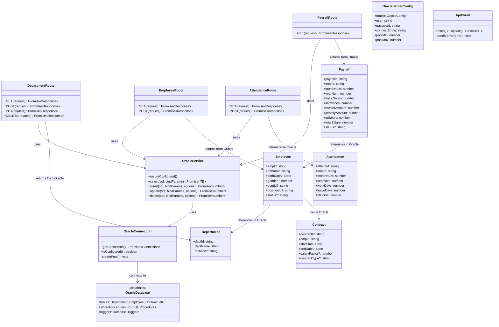

### 2.2. Các lớp chính trong hệ thống

#### 2.2.1. Service Layer Classes

**OracleService**
- **Mục đích:** Cung cấp interface thống nhất để truy cập Oracle Database
- **Phương thức:**
  - `select<T>()`: Thực thi SELECT queries trên Oracle Database
  - `insert()`: Thực thi INSERT statements vào Oracle Database
  - `update()`: Thực thi UPDATE statements trên Oracle Database
  - `delete()`: Thực thi DELETE statements trên Oracle Database
- **Đặc điểm:**
  - Static methods (không cần instantiate)
  - Tự động quản lý Oracle connection lifecycle
  - Hỗ trợ transaction control với Oracle Database
  - Tất cả dữ liệu được lưu trữ và truy xuất từ Oracle Database

**OracleConnection**
- **Mục đích:** Quản lý Oracle Database connection pool
- **Phương thức:**
  - `getConnection()`: Lấy Oracle connection từ pool
  - `isConfigured()`: Kiểm tra cấu hình Oracle Database
  - `initializeOraclePool()`: Khởi tạo Oracle connection pool
  - `closeOraclePool()`: Đóng Oracle connection pool
- **Đặc điểm:**
  - Singleton pattern cho Oracle connection pool
  - Tự động tạo pool khi khởi động với Oracle Database
  - Quản lý kết nối đến Oracle Database server

#### 2.2.2. Route Handler Classes

Mỗi route handler là một module Next.js Route Handler, không phải class theo nghĩa truyền thống, nhưng có cấu trúc tương tự:

**DepartmentRoute** (`app/api/departments/route.ts`)
- `GET()`: Lấy danh sách phòng ban từ Oracle Database
- `POST()`: Tạo phòng ban mới và lưu vào Oracle Database
- `PUT()`: Cập nhật phòng ban trong Oracle Database
- `DELETE()`: Xóa phòng ban khỏi Oracle Database

**EmployeeRoute** (`app/api/employees/route.ts`)
- `GET()`: Lấy danh sách nhân viên từ Oracle Database
- `POST()`: Tạo nhân viên mới và lưu vào Oracle Database

**Tương tự cho các route khác...** Tất cả đều thao tác trực tiếp với Oracle Database, không sử dụng mock data.

#### 2.2.3. Data Model Classes (TypeScript Interfaces)

**Department**
```typescript
interface Department {
  deptId: string;
  deptName: string;
  location?: string;
}
```

**Employee**
```typescript
interface Employee {
  empId: string;
  fullName: string;
  birthDate?: Date | string;
  gender?: number; // 1=Nam, 0=Nữ
  deptId?: string;
  positionId?: string;
  joinDate?: Date | string;
  status?: string; // ACTIVE/INACTIVE
}
```

**Contract**
```typescript
interface Contract {
  contractId: string;
  empId: string;
  startDate: Date | string;
  endDate?: Date | string;
  salaryFactor?: number;
  contractType?: string;
}
```

**Attendance, Payroll, Reward, Penalty, SalaryPayment** (tương tự)

#### 2.2.4. Configuration Classes

**ServerConfig**
- Quản lý cấu hình server-side cho Oracle Database (credentials, connection string, pool settings)
- Đọc từ environment variables (ORACLE_USER, ORACLE_PASSWORD, ORACLE_CONNECTION_STRING, etc.)
- Cấu hình kết nối Oracle Database cho toàn bộ hệ thống

**PublicConfig**
- Quản lý cấu hình client-side (API base URL)
- Exposed qua `NEXT_PUBLIC_*` variables

**ApiClient**
- Wrapper cho fetch API
- Xử lý timeout, error handling
- Type-safe với TypeScript generics
- Gọi API routes, các routes này sẽ truy vấn Oracle Database

### 2.3. Quan hệ giữa các lớp

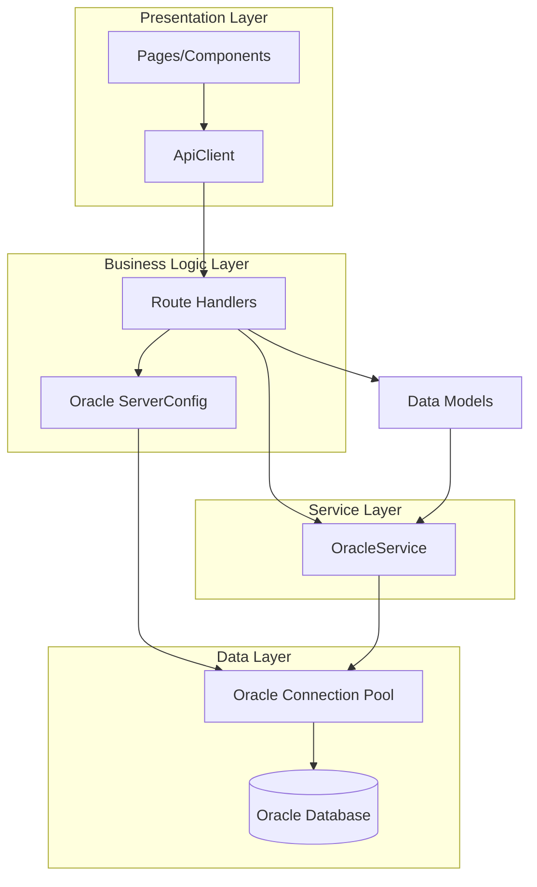

**Các quan hệ chính:**

1. **Composition (Thành phần)**
   - Route Handlers **sử dụng** OracleService
   - OracleService **sử dụng** OracleConnection

2. **Dependency (Phụ thuộc)**
   - Components **phụ thuộc** vào ApiClient
   - ApiClient **phụ thuộc** vào Route Handlers

3. **Association (Liên kết)**
   - Data Models **liên kết** với Oracle Database Tables
   - Employee **liên kết** với Department và Position trong Oracle Database

4. **Aggregation (Tập hợp)**
   - Payroll **tập hợp** các thông tin từ Employee, Attendance, Reward, Penalty trong Oracle Database

### 2.4. Áp dụng Nguyên lý Hướng đối tượng (OOP Principles)

#### 2.4.1. Encapsulation (Đóng gói)

**Ví dụ: OracleService**
- Ẩn chi tiết implementation của Oracle Database connection
- Chỉ expose các phương thức public cần thiết để truy cập Oracle Database
- Internal methods (`ensureConfigured`, `withConnection`) là private

```typescript
class OracleService {
  // Private helper method - kiểm tra cấu hình Oracle Database
  private static ensureConfigured() { ... }
  
  // Public API - thao tác với Oracle Database
  public static async select<T>(...) { ... }  // SELECT từ Oracle
  public static async insert(...) { ... }     // INSERT vào Oracle
}
```

#### 2.4.2. Abstraction (Trừu tượng hóa)

**Ví dụ: ApiClient**
- Ẩn chi tiết của HTTP requests
- Cung cấp interface đơn giản: `apiFetch<T>(url, options)`
- Xử lý timeout, error handling tự động

#### 2.4.3. Inheritance (Kế thừa)

**Không áp dụng trực tiếp** vì sử dụng composition pattern, nhưng có thể mở rộng:

```typescript
// Có thể tạo base class cho Route Handlers
abstract class BaseRouteHandler {
  protected async handleError(error: Error): Promise<Response> { ... }
  protected validateRequest(data: any): boolean { ... }
}

class DepartmentRoute extends BaseRouteHandler {
  // Inherit error handling và validation
}
```

#### 2.4.4. Polymorphism (Đa hình)

**Ví dụ: OracleService methods**
- `select<T>()` có thể trả về bất kỳ type nào (generic)
- Cùng một method có thể xử lý nhiều loại data khác nhau

```typescript
// Polymorphism qua generics - truy vấn Oracle Database
const departments = await OracleService.select<Department>(sql);  // Từ Oracle DB
const employees = await OracleService.select<Employee>(sql);      // Từ Oracle DB
```

#### 2.4.5. Single Responsibility Principle (SRP)

- **OracleService**: Chỉ chịu trách nhiệm truy cập Oracle Database
- **Route Handlers**: Chỉ chịu trách nhiệm xử lý HTTP requests và gọi Oracle Service
- **ApiClient**: Chỉ chịu trách nhiệm gọi API (API sẽ truy vấn Oracle Database)

#### 2.4.6. Open/Closed Principle (OCP)

- Có thể mở rộng OracleService với các phương thức mới mà không sửa code cũ
- Có thể thêm route handlers mới mà không ảnh hưởng đến các route hiện có

#### 2.4.7. Dependency Inversion Principle (DIP)

- Route Handlers phụ thuộc vào abstraction (OracleService) chứ không phụ thuộc vào concrete implementation của Oracle Database
- Trong production, tất cả đều sử dụng Oracle Database thực tế
- Có thể thay thế OracleService bằng mock service để testing (nhưng production luôn dùng Oracle DB)

### 2.5. Tổng kết

**Điểm mạnh:**
- ✅ Tách biệt rõ ràng các trách nhiệm
- ✅ Dễ dàng test và maintain
- ✅ Type-safe với TypeScript
- ✅ Có thể mở rộng dễ dàng

**Cải tiến có thể:**
- Thêm Repository pattern để tách biệt Oracle Database access logic
- Thêm DTO (Data Transfer Objects) để tách biệt domain models và API models
- Thêm Validation layer riêng biệt
- Tối ưu Oracle Database queries với indexing và query plans

---

## 3. THIẾT KẾ TƯƠNG TÁC (INTERACTION DESIGN)

### 3.1. Sequence Diagram - Luồng Tạo Nhân Viên

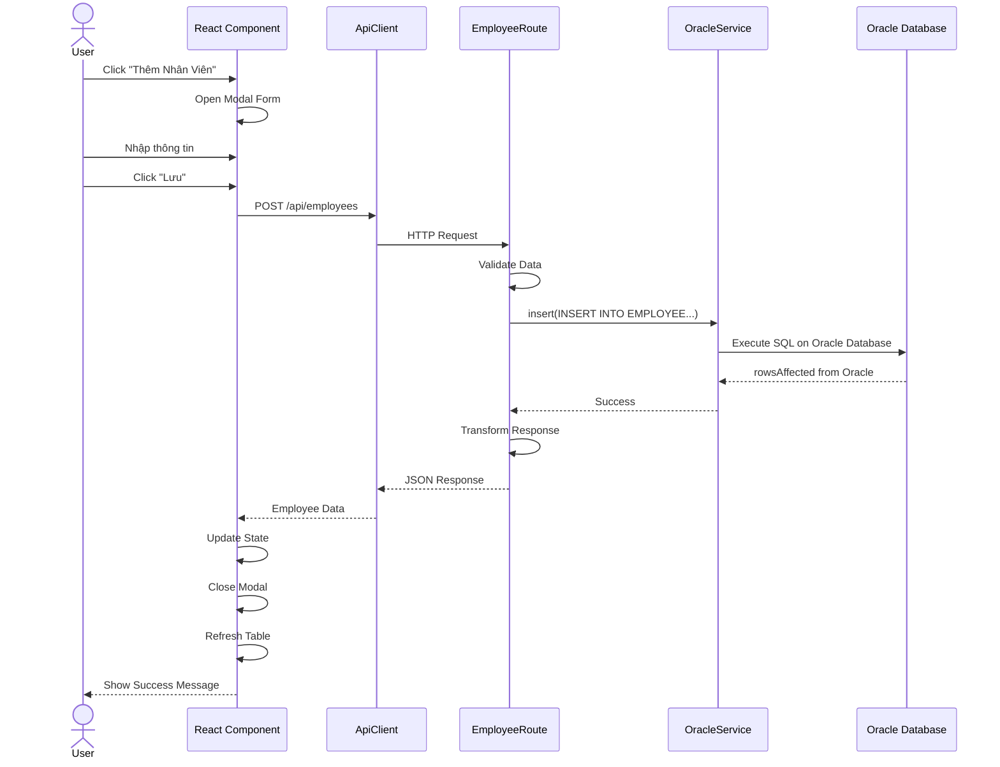

### 3.2. Sequence Diagram - Luồng Tính Lương

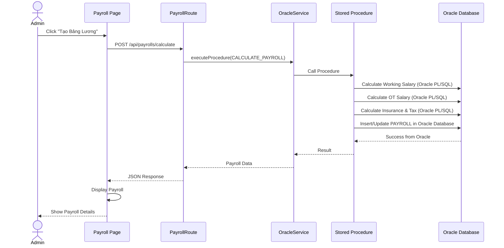

### 3.3. Sequence Diagram - Luồng Xem Chấm Công

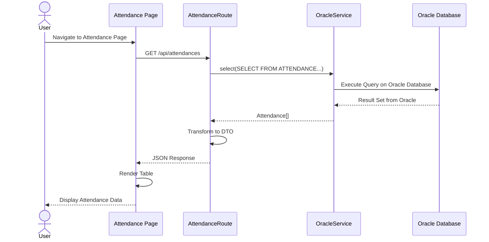

### 3.4. Component Interaction Diagram

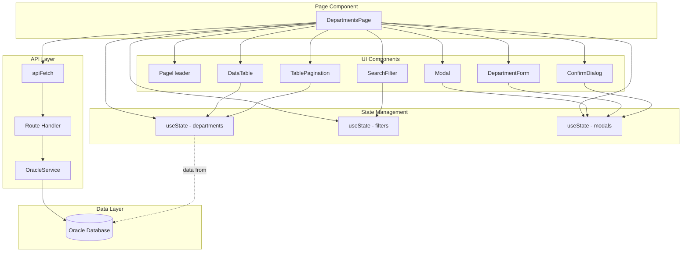

---

## 4. THIẾT KẾ HÀNH VI (BEHAVIORAL DESIGN)

### 4.1. State Machine - Trạng thái Hợp đồng

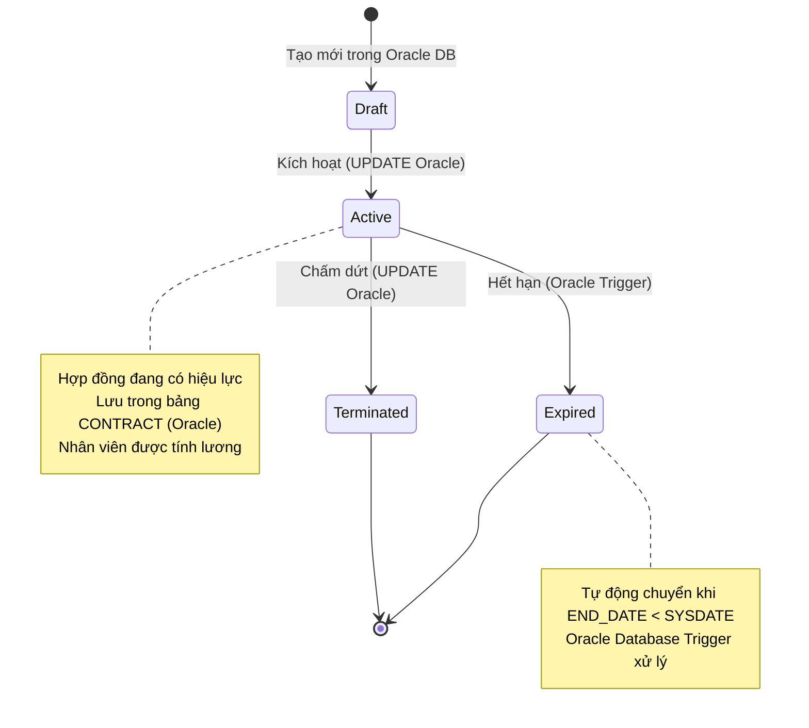

### 4.2. State Machine - Trạng thái Bảng Lương

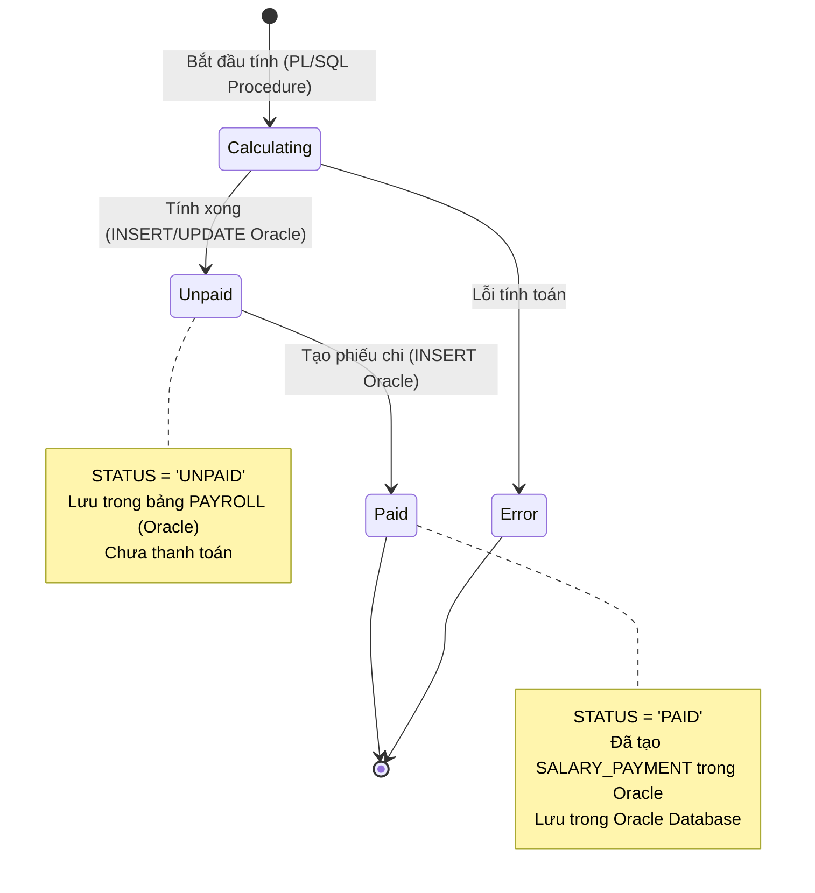

### 4.3. Activity Diagram - Quy trình Tính Lương

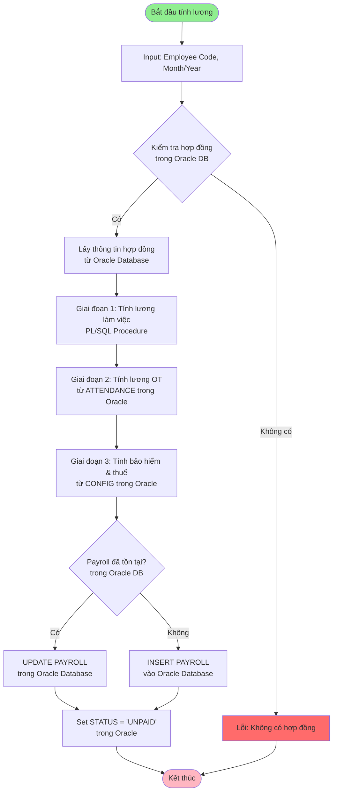

### 4.4. Activity Diagram - Quy trình Tạo Phiếu Chi

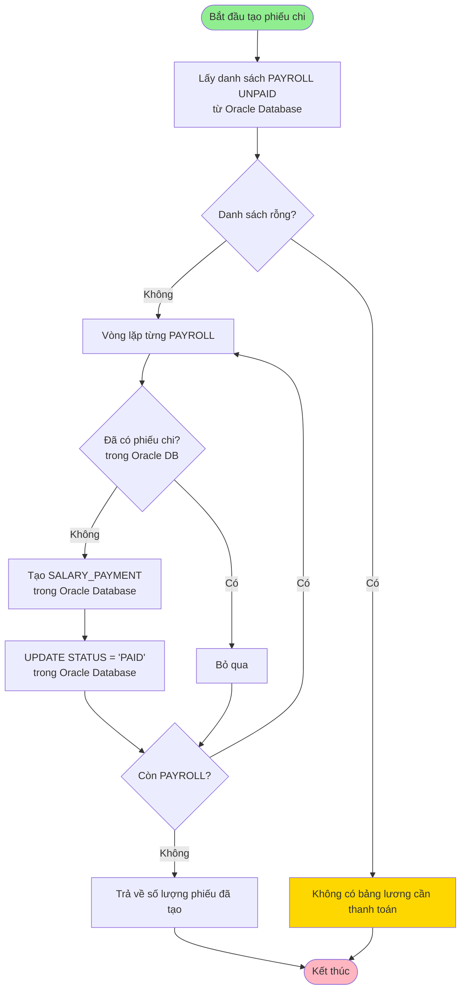

### 4.5. Use Case Diagram

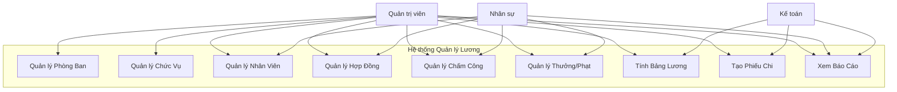

### 4.6. Collaboration Diagram - Tính Lương

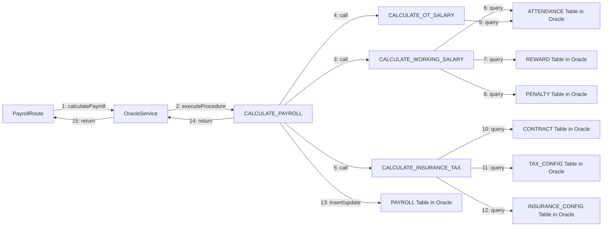

---

## KẾT LUẬN

Tài liệu này mô tả chi tiết kiến trúc hệ thống Quản lý Lương theo mô hình 3 lớp, các lớp và quan hệ giữa chúng, cũng như các luồng tương tác và hành vi của hệ thống. **Tất cả dữ liệu của hệ thống đều được lưu trữ và quản lý trong Oracle Database**, đảm bảo tính nhất quán, bảo mật và hiệu năng cao. Thiết kế này đảm bảo:

- **Tính mở rộng:** Dễ dàng thêm tính năng mới với Oracle Database
- **Tính bảo trì:** Code rõ ràng, có cấu trúc, tất cả dữ liệu tập trung trong Oracle DB
- **Tính an toàn:** Validation và error handling đầy đủ, Oracle Database cung cấp ACID properties
- **Hiệu năng:** Oracle connection pooling và tối ưu queries với Oracle Database engine
- **Tính nhất quán:** Tất cả dữ liệu được lưu trữ tập trung trong Oracle Database, không có mock data hay dữ liệu tạm thời

---

**Tài liệu này có thể được chuyển đổi sang DOCX bằng:**
1. Pandoc: `pandoc System-Architecture-Documentation.md -o System-Architecture-Documentation.docx`
2. Online converters (Markdown to DOCX)
3. Microsoft Word (Import Markdown)

